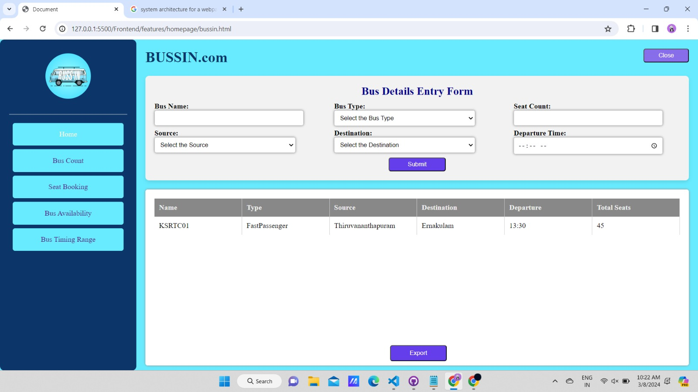

# Bussin
## Introduction
This project is a Bus Details Management System designed to manage and display bus schedules based on user inputs regarding bus details such as source, destination, type, and time range. The system allows users to input bus details and then filter the generated information based on specific criteria.

## Features
* **Input Bus Details:** A detailed information about buses, including unique bus name, bus type, source, destination, departure time, and available seats, can be input through a
user-friendly form.

* **Filtering:** The system filters the generated bus schedule information based on the user's specified criteria including:
  
    1. *Source*
    2. *Destination*
    3. *Both Source and Destination*
    4. *Time Range*

* **Display:** Filtered bus details are displayed for the user, providing users with an overview of all available buses at a glance.
  
* **Export Bus Details:** It has a functionality to export the entered bus details as a JSON file by clicking on the export button.

* **Seat Booking:** The system facilitates seat booking operations, allowing users to reserve or
release seats on available buses directly through the interface.

* **Bus Type Counts:** Users can view counts of buses based on their type, providing insights into the distribution of different bus types within the system

## Usage
The website's homepage allows the user to input the bus details and it is displayed in a tabular manner which can be exported as a JSON file. The side navigation bar allows one to navigate to the bus count page, seat booking page, time range and source and destination filtering pages. 

## Contributing
Contributions to the project are welcome! Feel free to fork the repository, make your changes, and submit a pull request.
